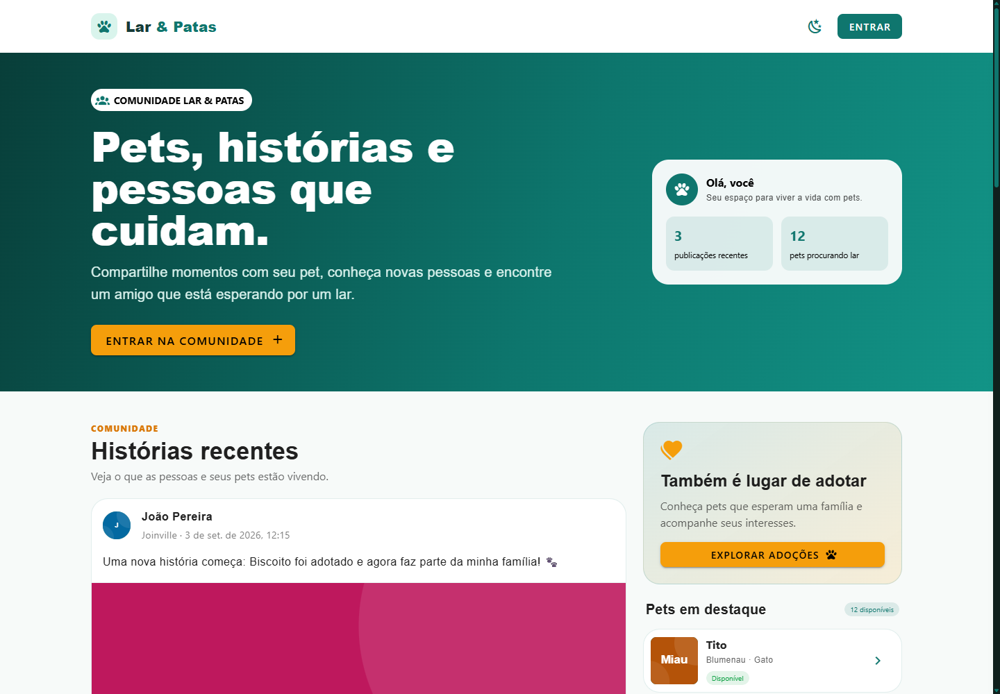
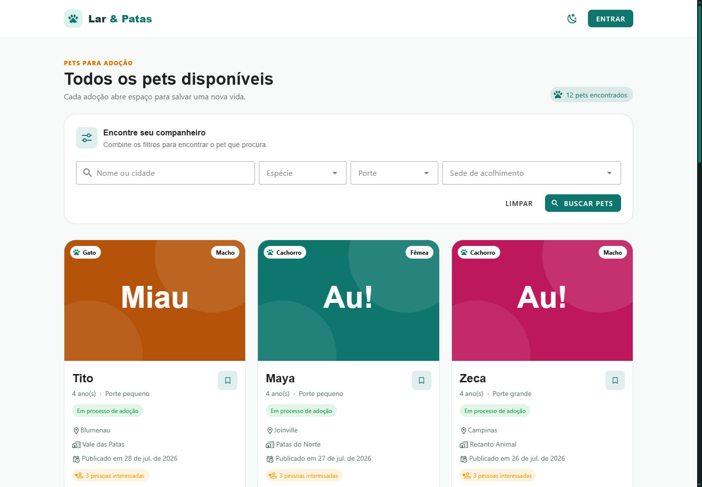
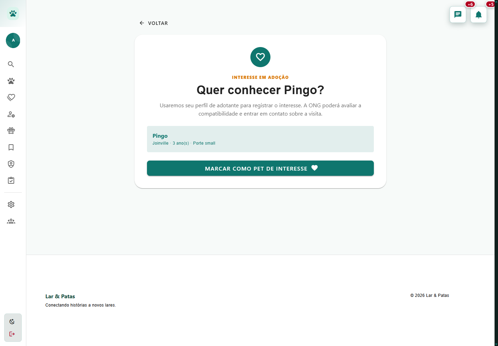
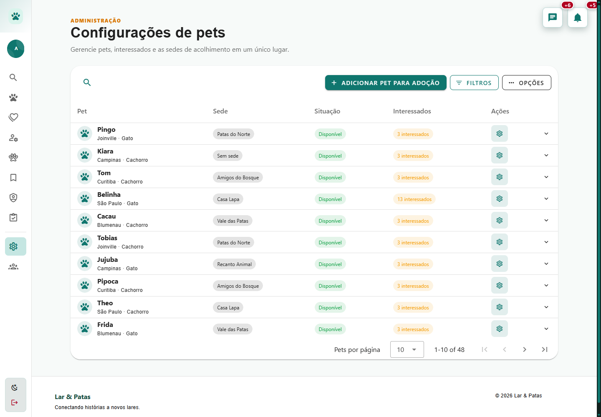

# Lar & Patas

Plataforma de adoção responsável de cães e gatos, com pets, solicitações e acompanhamento de adoções, favoritos, comunidade, mensagens e notificações. A administração gerencia usuários, pets, abrigos e retiradas.

## Demonstração

Capturas da aplicação com dados dos seeders:

| Página inicial | Explorar pets |
| --- | --- |
|  |  |
| Solicitação de adoção | Administração |
|  |  |

## Tecnologias e requisitos

- PHP 8.3+ e Composer 2; extensões usuais do Laravel, incluindo `fileinfo`, `pdo_mysql`, `mbstring`, `dom` e `xml`.
- Laravel 13, Sanctum e filas no banco de dados.
- MySQL 8; SQLite com `pdo_sqlite` para testes e demonstração alternativa.
- Node.js 22.12+ e npm; Vue 3, Vuetify, Pinia e Vite.
- Ably para tempo real, mediante configuração de uma chave própria.
- Git.

Redis e Horizon não são necessários para a configuração padrão.

## Instalação

```bash
git clone https://github.com/SamuelPereiraBrandao/Lar-Patas.git
cd Lar-Patas
composer install
npm ci
```

O `.npmrc` desativa scripts de instalação e usa `legacy-peer-deps` para reproduzir o lockfile atual: o Vuetify 3.4 declara um peer antigo para `vite-plugin-vuetify`. As versões permanecem fixadas nos arquivos de lock.

Copie a configuração de exemplo:

```bash
cp .env.example .env
```

No PowerShell ou CMD do Windows:

```powershell
copy .env.example .env
```

Crie um banco MySQL vazio chamado `pet_adoption` e configure seu usuário e senha no `.env`:

```env
APP_NAME="Lar & Patas"
APP_URL=http://localhost:8000
SANCTUM_STATEFUL_DOMAINS=localhost:8000,127.0.0.1:8000
DB_CONNECTION=mysql
DB_HOST=127.0.0.1
DB_PORT=3306
DB_DATABASE=pet_adoption
DB_USERNAME=root
DB_PASSWORD=
QUEUE_CONNECTION=database
SESSION_DRIVER=file
CACHE_STORE=file
MAIL_MAILER=log
```

Para uma demonstração local sem MySQL, crie um arquivo vazio `database/database.sqlite` e substitua estas variáveis:

```env
DB_CONNECTION=sqlite
DB_DATABASE=/caminho/absoluto/Lar-Patas/database/database.sqlite
```

No Windows, use um caminho como `C:/projetos/Lar-Patas/database/database.sqlite`.

Depois execute:

```bash
php artisan key:generate
php artisan migrate --seed
php artisan storage:link
npm run build
```

O seeder cria 30 contas de demonstração, 48 pets, abrigos, localidades, adoções e conteúdo da comunidade. Ele tenta baixar fotos do Unsplash; se a conexão falhar, gera ilustrações locais. Use um banco vazio para a primeira carga. As contas de demonstração são destinadas à avaliação local.

## Executando a aplicação

Abra quatro terminais e mantenha os processos ativos:

**1. Servidor Laravel**

```bash
php artisan serve
```

**2. Frontend com atualização automática**

```bash
npm run dev
```

**3. Todas as filas de jobs, e-mails e eventos do Ably**

```bash
php artisan queue:work --queue=default,ably,ably-messages,ably-notifications-messages,ably-notifications
```

**4. Agendamento dos lembretes de adoção**

```bash
php artisan schedule:work
```

Abra o endereço exibido por `php artisan serve`, usando o mesmo host definido em `APP_URL`. Com o build gerado, o terminal do Vite é opcional para apresentar a aplicação.

Como alternativa aos quatro terminais, `composer run dev` inicia o servidor, frontend, worker das filas e scheduler configurados pelo projeto. Não é necessário executar as duas formas simultaneamente.

No PowerShell, se `npm.ps1` for bloqueado pela política de execução, utilize `npm.cmd ci`, `npm.cmd run build` e `npm.cmd run dev`.

## Login e roteiro de apresentação

Todas as contas de demonstração usam a senha `password`:

| Perfil | E-mail |
| --- | --- |
| Administrador | `admin@larepatas.test` |
| Doadora | `ana@larepatas.test` |
| Adotante | `gabriela@larepatas.test` |

O login exige um código de seis dígitos enviado por e-mail. Com `MAIL_MAILER=log`, consulte a mensagem mais recente em `storage/logs/laravel.log` e informe o código na tela de confirmação. Nenhuma conta SMTP é necessária nesse modo.

Roteiro sugerido (5–10 minutos):

1. Abra a página inicial e apresente o propósito do projeto.
2. Acesse **Explorar pets**, use os filtros e abra os detalhes de um animal disponível.
3. Entre como adotante, favorite um pet e envie uma solicitação de adoção. Acompanhe o pedido no painel.
4. Entre como administrador para apresentar a gestão de pets, usuários e solicitações. Agende uma retirada.
5. Volte ao painel do adotante para mostrar a data e o código de retirada. A transferência de responsabilidade só acontece quando o administrador valida esse código.
6. Apresente o perfil, uma publicação com foto e as interações da comunidade. Para demonstrar atualizações em tempo real entre duas sessões, configure o Ably e mantenha o worker ativo.

## E-mail e Ably

O `.env.example` inclui campos SMTP genéricos. Para enviar e-mails reais, substitua pelos dados de seu provedor:

```env
MAIL_MAILER=smtp
MAIL_SCHEME=smtp
MAIL_HOST=smtp.seuprovedor.com
MAIL_PORT=587
MAIL_USERNAME=seu_usuario
MAIL_PASSWORD=sua_senha
MAIL_FROM_ADDRESS=contato@seudominio.com
MAIL_FROM_NAME="${APP_NAME}"
```

Para tempo real:

```env
ABLY_API_KEY=sua_chave_ably
ABLY_VERIFY_SSL=true
```

A chave Ably tem formato `keyName:secret` e deve permanecer no backend. Nunca versione o `.env`. Depois de alterar configurações, execute `php artisan optimize:clear` e reinicie os workers.

## Imagens

Uploads ficam em `storage/app/public`, com caminhos registrados no banco. Posts usam `profiles/posts`, avatares `profiles/avatars`, banners `profiles/banners` e pets `pets`/`pets/gallery`.

O limite é **3 MB por imagem**, nos formatos JPG, PNG e WebP. Posts aceitam até 5 fotos; galerias de pets, até 10. O frontend prepara e comprime as fotos, e o backend valida o envio. O servidor também limita o tamanho total da requisição: configure `upload_max_filesize` com pelo menos `3M` e `post_max_size` com margem para múltiplas fotos, por exemplo `40M`.

## Testes, build e integração contínua

```bash
php artisan test --compact
npm run build
```

Os testes usam SQLite em memória, conforme `phpunit.xml`. Não é necessário configurar Redis, SMTP ou Ably para executá-los.

O workflow [Testes e build](.github/workflows/ci.yml) roda em pushes, pull requests e execução manual. Instala as dependências pelos lockfiles, valida migrations e seeders em MySQL vazio, gera o build e executa os testes. Os resultados aparecem na aba **Actions** do GitHub após o envio do workflow ao repositório.

## API e comandos úteis

[Documentação da API no Postman](https://documenter.getpostman.com/view/32790910/2sBYAxNoWP).

Inicie a aplicação e o worker, configure no Postman a URL do seu servidor e execute a autenticação antes das requisições protegidas.

```bash
php artisan route:list
php artisan optimize:clear
php artisan queue:failed
```

Para recriar a demonstração em um banco local descartável:

```bash
php artisan migrate:fresh --seed
```

**Esse último comando apaga todas as tabelas do banco configurado.**
